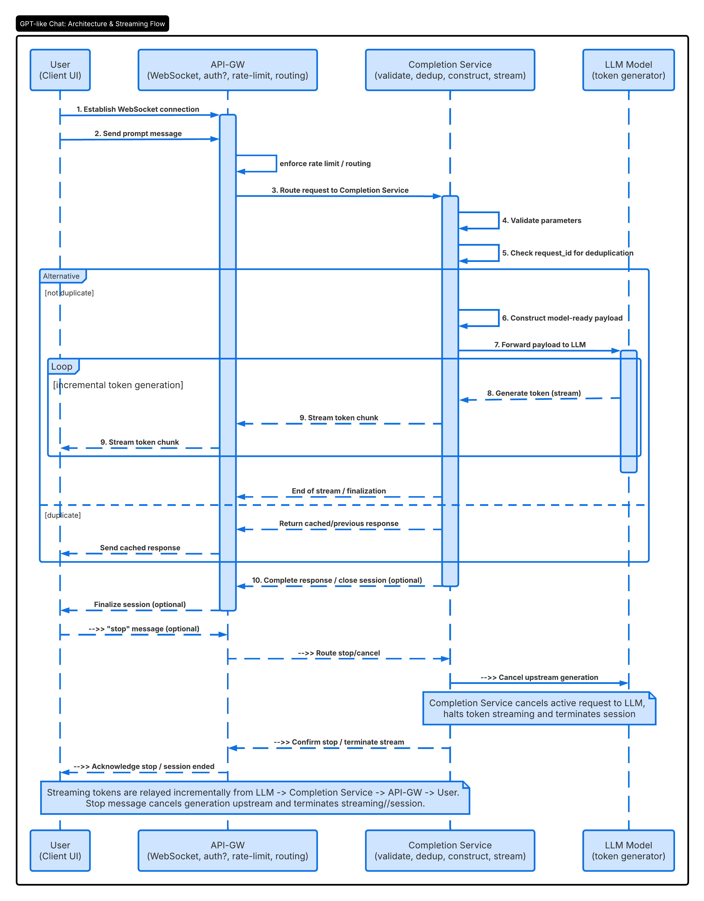

# ChatGPT

## Functional Requirements
### Tool
- A playground to submit a message to LLM
- Sidebar setting to specify model, temperature, max length
- call a pre-trained, externally hosted API
- stream or return completion back to the front end

### Persistence + APIs
- saving presets
- listing/editting existing presets

### Out of Scope
- Model training
- Core ML / Infra Architecture
- Auth / billing / user management

### Metrics
- DAU: 10 mil
- Avg prompts / user each day: 10
- Daily prompt volume: 100 mil / day
- Avg prompt QPS: 1,000
- Peak prompt QPS: 10,000
- Concurrent session: 100,000, 10k QPS * 10s per generation = 100k live responses
- Tokens / prompt: 1,000 - 300 in, 700 out
- Daily token throughput: 100 billion, 1k tokens * 100M prompts`
- Preset saves per day: 10 mil
- Concurrent session: 1 mil
- Preset DB growth: 10 GB / day
- Model calls: 10 - 20k / sec, 10k baseline + retries / tool calls = max 20k

Make sure to be able to lead several deep dives and explain a story of trade-offs

## Non-Functional Requirements
1. Low latency: Time to first token <= 300ms, e2e completion < 2s (p95)
   - how to avoid long tails
2. High availability:99.9%
   - how to prevent a partial outage
3. Rate limiting < 60 requests / user per min & < 2 concurrent generations per user
4. Scalability: 10k QPS & 100k concurrent streaming sessions

Make sure spam or traffic spike would not overwhelm the system

## Deep Dive
### FR1 - Submit prompt & view completion
```
API
{
  event: "generate"
  request_id: "uuid-111111" // optional idempotency key
  prompt: "who will win World Cup 2026?"
  temperature: 0.5 // 0 = deterministic, 1 = extremely creative
  max_token: 256 
  top_p: 1 // top-p sampling: limit to top cumulative probability mass
  frequency penalty: 0.5
  model: gpt-5
  stream: true
}
{
  request_id: "uuid-111111"
  response: "Messi"
}
```
DTO object need to include user_id from session data as well, and the data lives within the lifecycle of a request



### FR2 - Adjust generation parameters
### FR3 - Save prompt as a preset
### FR4 - search, load, edit existing presets
